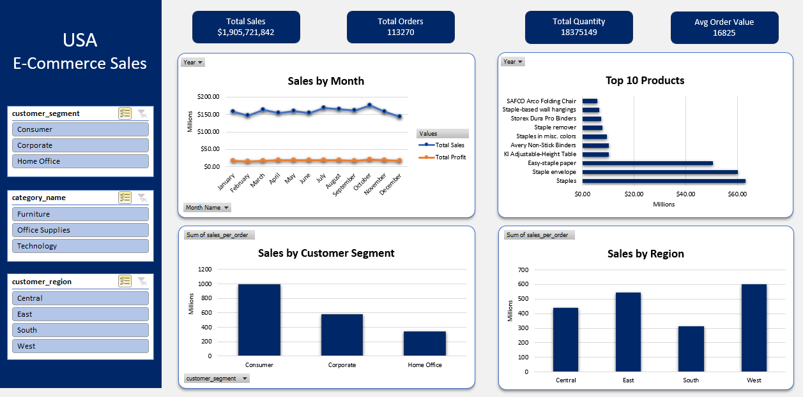
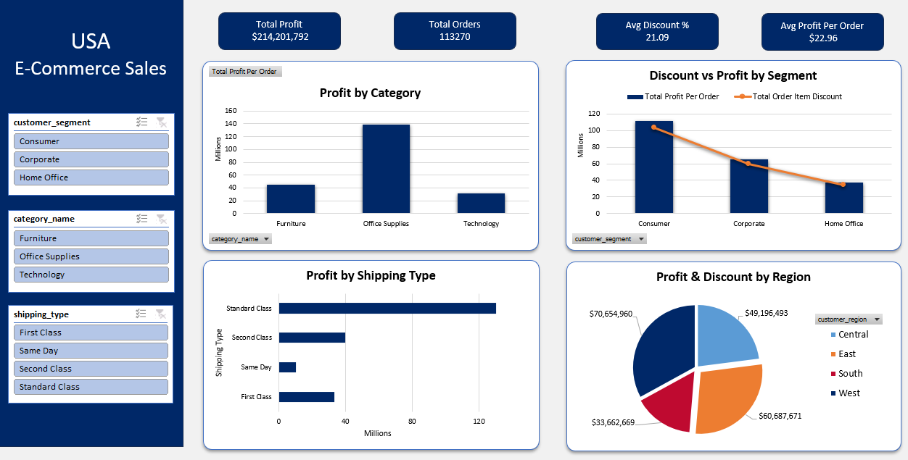

# 🛒 USA E-Commerce Sales Analysis Dashboard (Excel Project)

## 📌 Project Overview

This Excel-based analytics project provides deep insights into the sales performance and profitability of an e-commerce company in the USA. It leverages Excel features like Power Query, Power Pivot, Data Modeling, DAX, and Pivot Charts to build interactive dashboards.

---

## 🎯 Objective

To analyze USA-based e-commerce sales data and uncover insights that help management make informed decisions about revenue performance, product trends, customer segmentation, discounts, and profitability.

---

## ❓ Business Questions Answered

- Which product categories and regions contribute the most to sales and profit?
- Who are our top-performing customer segments and products?
- How do discounts impact profit across segments and shipping types?
- Which regions or categories need strategic attention due to low profitability?

---

## 📊 Key Features

### 🔹 Dashboard 1: Sales Overview
- **KPIs**: Total Sales, Total Orders, Total Quantity, Avg. Order Value
- **Charts**:
  - Sales by Month (Line Chart)
  - Top 10 Products by Sales (Bar Chart)
  - Sales by Customer Segment (Bar Chart)
  - Sales by Region (Bar Chart)
- **Slicers**: Segment, Category, Region

### 🔹 Dashboard 2: Profit & Discount Overview
- **KPIs**: Total Profit, Total Orders, Avg. Discount %, Avg. Profit per Order
- **Charts**:
  - Profit by Category (Bar Chart)
  - Profit vs Discount by Segment (Combo Chart)
  - Profit by Shipping Type (Bar Chart)
  - Profit & Discount by Region (Pie Chart)
- **Slicers**: Segment, Category, Shipping Type

---

## 🛠️ Technologies Used

- **Excel Power Query** – Data cleaning and transformation  
- **Excel Power Pivot** – Data modeling and DAX calculations  
- **Pivot Tables & Charts** – Analysis and visualization  
- **Slicers** – Interactive filtering

---

## 📂 How to Use

1. Clone the repository or download the `.xlsx` file.
2. Open the file in Microsoft Excel (Recommended: Excel 365 or 2021).
3. Use the slicers to explore interactive visualizations.
4. Analyze trends, segment insights, and profitability.
